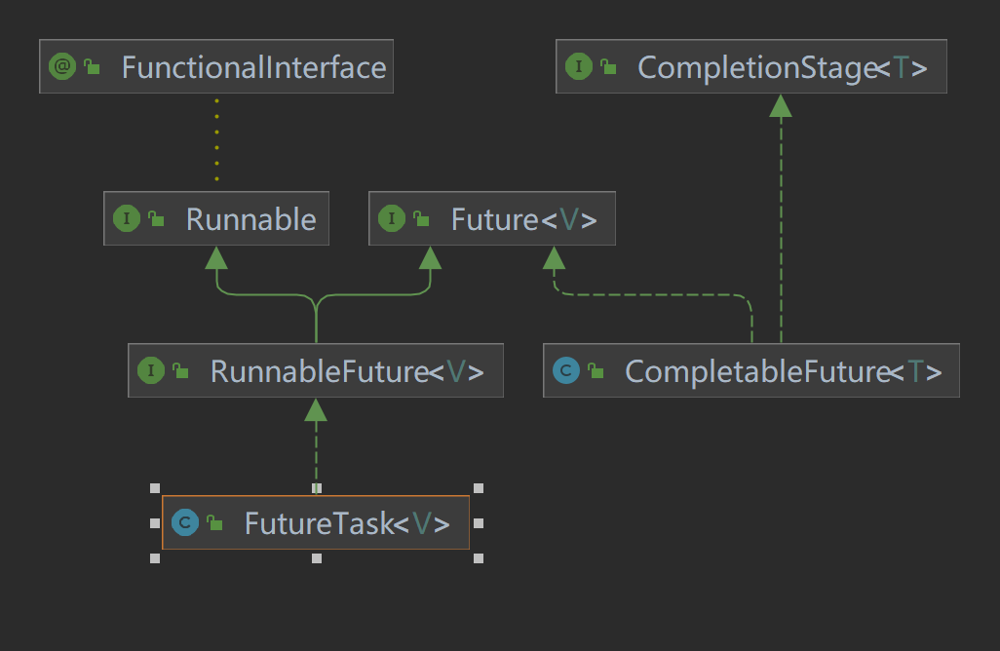
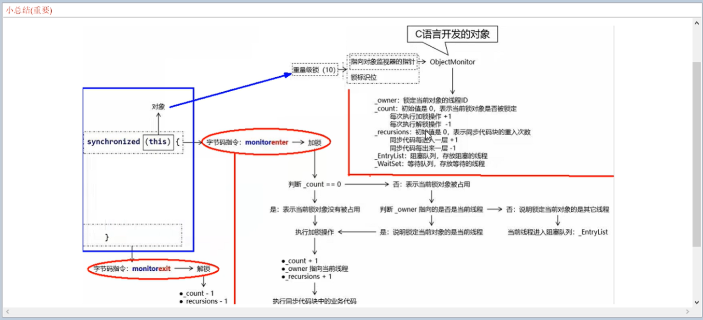

## JUC并发编程

### Thread

得到线程的四种方法：

- 继承Thread类
- 实现Runnable接口
- 实现Callable接口
- 从线程池`ExecutorService.newFixedThreadPool()`中获取线程 

### Future

...

### CompletableFuture

CompletableFuture 是 Java 中用于实现异步编程和 Futures/CompletableFutures 模式的类，提供了丰富的方法来构建复杂的异步流程。以下是一些 CompletableFuture 的常用方法：
1. **创建 CompletableFuture**

  - $\textcolor{green}{CompletableFuture.runAsync(Runnable runnable)}$ 创建一个无返回值的异步任务，执行给定的 Runnable。任务将在 ForkJoinPool.commonPool() 中异步执行。
  - $\textcolor{green}{CompletableFuture.supplyAsync(Supplier supplier)} $ 创建一个有返回值的异步任务，执行给定的 Supplier。任务同样在 ForkJoinPool.commonPool() 中异步执行，返回值类型由 Supplier.get() 方法决定。
  - CompletableFuture.runAsync(Runnable runnable, Executor executor) 和 runAsync(Runnable) 类似，但允许指定自定义的 Executor 来执行任务。
  - CompletableFuture.supplyAsync(Supplier<U> supplier, Executor executor) 同样与 supplyAsync(Supplier) 类似，允许指定自定义的 Executor 执行有返回值的任务。

2. **链式组合操作** 

  - thenApply(Function<? super T,? extends U> fn) 当前 CompletableFuture 完成后，应用给定的函数到其结果上，并返回一个新的 CompletableFuture，其结果是该函数的返回值。

  - thenAccept(Consumer<? super T> action) 当前 CompletableFuture 完成后，消费其结果并执行给定的 Consumer，新 CompletableFuture 的结果类型为 Void。

  - $\textcolor{green}{thenCompose(Function<? super T,? extends CompletionStage<U>> fn) }$ 当前 CompletableFuture 完成后，应用给定的函数到其结果上，该函数应返回一个新的 CompletionStage。新 CompletableFuture 的结果将是该 CompletionStage 完成后的结果。

  - thenRun(Runnable action) 当前 CompletableFuture 完成后，执行给定的 Runnable，新 CompletableFuture 的结果类型为 Void。

    **==注：==**以上链式组合方法都有对应的异步版本，即以 Async 结尾的方法，如 thenApplyAsync、thenAcceptAsync、thenComposeAsync 和 thenRunAsync，它们会在另一个线程中执行后续操作。

3. **组合多个 CompletableFuture** 

- thenCombine(CompletionStage<? extends U> other, BiFunction<? super T,? super U,? extends V> fn) 当当前 CompletableFuture 和另一个 CompletionStage 都完成后，使用给定的 BiFunction 将两个结果合并为一个单一结果，返回新的 CompletableFuture。

- applyToEither(CompletionStage<? extends T> other, Function<? super T, U> fn) 当当前 CompletableFuture 或另一个 CompletionStage 中任意一个首先完成时，应用给定的函数到其结果上，返回新的 CompletableFuture。
- thenAcceptBoth(CompletionStage<? extends U> other, BiConsumer<? super T, ? super U> action) 当当前 CompletableFuture 和另一个 CompletionStage 都完成后，使用给定的 BiConsumer 同时消费两个结果，新 CompletableFuture 的结果类型为 Void。
  runAfterBoth(CompletionStage<?> other, Runnable action) 当当前 CompletableFuture 和另一个 CompletionStage 都完成后，执行给定的 Runnable，新 CompletableFuture 的结果类型为 Void。
  这些组合方法同样有对应的异步版本，如 thenCombineAsync、applyToEitherAsync、thenAcceptBothAsync 和 runAfterBothAsync。

4. **错误处理与恢复** 

- exceptionally(Function<Throwable,? extends T> fn) 当前 CompletableFuture 因异常而未能正常完成时，应用给定的函数处理该异常，返回一个新的 CompletableFuture，其结果由该函数返回。

- handle(BiFunction<? super T, Throwable, ? extends U> fn) 不论当前 CompletableFuture 正常完成还是因异常未能完成，都会应用给定的 BiFunction 处理结果或异常，返回一个新的 CompletableFuture。
- whenComplete(BiConsumer<? super T, ? super Throwable> action) 当前 CompletableFuture 完成时（无论正常完成还是出现异常），执行给定的 BiConsumer，它接受结果和可能的异常作为参数。新 CompletableFuture 的结果与原 CompletableFuture 相同。
- completeOnTimeout(T value, long timeout, TimeUnit unit) 如果当前 CompletableFuture 在指定的超时时间内未完成，将其完成为给定的值。此方法是过时的，推荐使用 orTimeout。

5. **其他重要方法**

- get() 阻塞当前线程直到 CompletableFuture 完成，并返回其结果。如果 CompletableFuture 完成时抛出异常，则该方法将重新抛出该异常。
- get(long timeout, TimeUnit unit) 同 get(), 但添加了超时限制。如果在指定时间内 CompletableFuture 仍未完成，将抛出 TimeoutException。
- join() 非阻塞地获取 CompletableFuture 的结果。如果 CompletableFuture 还未完成，将抛出 CompletionException 包装原始异常。
- cancel(boolean mayInterruptIfRunning) 尝试取消 CompletableFuture。如果可能中断正在运行的任务，并且任务是可以中断的，则可能会中断它。
- isDone() 判断 CompletableFuture 是否已经完成（正常完成、异常完成或已取消）。
- isCancelled() 判断 CompletableFuture 是否已取消。
- isCompletedExceptionally() 判断 CompletableFuture 是否因异常而未能正常完成。




### ReentrantLock

ReentrantLock 是 Java 并发包（java.util.concurrent.locks）中的一种可重入互斥锁，在默认情况下创建的 ReentrantLock 是非公平的。如果希望创建一个公平锁（遵循先请求先获得的原则）可以传入 true 参数。

相比于传统的 synchronized 关键字，它提供了更丰富的功能和更高的灵活性。以下是 ReentrantLock 的常见使用场景及用法：

1. 获取锁

- 使用 lock() 方法获取锁，如果锁此时已被其他线程持有，当前线程将被阻塞，直到锁被释放

2. 释放锁

- 在完成临界区代码后，必须使用 unlock() 方法显式释放锁，否则可能导致死锁或其他线程无法获得锁

```java
ReentrantLock lock = new ReentrantLock();
try {
    lock.lock();
    // 临界区代码...
} finally {
    lock.unlock();
}
```

3. 可重入性

- ReentrantLock 具有可重入性，即已经持有锁的线程可以再次获取该锁而不被阻塞。每次获取锁时，锁的持有计数增加，释放锁时计数减小。当计数降至 0 时，锁才真正释放给其他线程

4. 条件变量（Condition）

- ReentrantLock 提供了 newCondition() 方法创建 Condition 对象，用于实现线程间的条件等待和通知。这使得在一个锁上可以维护多个等待队列，每个条件对应一个队列。与 Object 类的 wait()、notify()、notifyAll() 方法不同，Condition 提供了更细粒度的控制

5. 锁的尝试操作

- 除了正常的阻塞获取锁外，ReentrantLock 还提供了几种尝试获取锁的方法：
  - tryLock(): 尝试非阻塞地获取锁，若成功则返回 true，否则立即返回 false。
  - tryLock(long time, TimeUnit unit): 在指定时间内尝试获取锁，成功则返回 true，超时则返回 false。
  - tryLock(long time, TimeUnit unit, Predicate<Boolean> condition): 在指定时间内尝试获取锁，并在成功后检查额外的条件。若条件满足则返回 true，否则释放锁并返回 false。

6. 锁的查询与监控

- isLocked(): 判断锁是否被任何线程持有。
- isHeldByCurrentThread(): 判断锁是否被当前线程持有。
- getHoldCount(): 返回当前线程保持此锁的次数。
- getOwner(): 返回当前持有锁的线程（如果存在）。


### synchronized关键字

synchronized 用于实现线程同步，确保在多线程环境下，对共享资源的访问是线程安全的。它提供了互斥（mutual exclusion）和可见性（visibility）保证，以避免数据竞争、死锁、竞态条件等问题。以下是 synchronized 关键字的主要使用方式和特性：

1. **修饰实例方法:** 当 synchronized 修饰一个非静态实例方法时，它相当于对该方法所在的对象实例（即 this）加锁。在同一时刻，最多只有一个线程能够执行该方法。其他试图访问该方法的线程会被阻塞，直到持有锁的线程退出该方法，释放锁。
2. **修饰静态方法:** 当 synchronized 修饰一个静态方法时，它对整个类（即 Class 对象）加锁，而非特定的对象实例。因此，在同一时刻，最多只有一个线程能够执行该类的所有 synchronized 静态方法。
3. **修饰代码块:** synchronized 也可以修饰一个代码块，指定一个显式的锁对象。只有持有该锁对象的线程才能执行该代码块。
4. **内存可见性:** synchronized 不仅提供互斥，还确保了对共享变量的内存可见性。当一个线程退出 synchronized 代码块或方法时，它会将所有在该同步块中对变量的修改刷新到主内存中。当另一个线程进入对应的 synchronized 代码块或方法时，它会从主内存中获取最新的变量值
5. **重入性:** synchronized 锁是可重入的。这意味着一个线程在已经持有某个锁的情况下，可以再次进入由同一锁保护的 synchronized 代码块或方法，而不会被阻塞。这允许在嵌套或递归调用时保持锁的正确性

**synchronized的工作机制** 




### volatile关键字

volatile 用于修饰变量，以确保对变量的访问遵循一定的内存语义，特别是针对多线程环境中的共享变量。使用 volatile 关键字有以下几个关键特性：

1. **可见性:**
   当一个变量被声明为 volatile 后，对它的写操作会立即刷新到主内存中。同样，对 volatile 变量的读操作总是从主内存中获取最新值，而不是从本地线程缓存（如 CPU 缓存）中读取。这意味着对 volatile 变量的修改对其他线程来说是立即可见的，消除了由于缓存一致性问题导致的数据不一致现象。
2. **禁止指令重排序:**
   volatile 关键字还提供了某种程度的内存屏障效果，阻止编译器和处理器对涉及 volatile 变量的指令进行重排序。这确保了对 volatile 变量的操作与其他内存操作之间的顺序关系，防止因重排序而导致的并发问题。例如，如果一个线程先写入 volatile 变量，然后进行其他操作，另一个线程则可以确保在读取该 volatile 变量时，能看到前一线程的所有相关操作都已完成。
3. **非原子性:**
   虽然 volatile 提供了上述内存可见性和有序性保证，但它 不保证原子性。对于复合操作（如递增、递减、非同步的赋值等），即使使用 volatile 修饰，也仍然可能存在多线程下的数据竞争。对于需要原子性操作的场景，应使用 synchronized、`java.util.concurrent.atomic` 包中的原子类（如 `AtomicInteger`、`AtomicLong` 等）或 Lock 接口及其实现。
4. 适用场景:
   volatile 适用于以下情况：
   单个变量的读写操作简单（如状态标志的设置与检查）且不需要原子性保证。
   多线程之间通过共享变量进行通信，且只需要确保变量的最新值对所有线程可见。
   需要禁止指令重排序以维持特定的执行顺序。

**示例代码：** 

```java
public class VolatileExample {
    private volatile boolean ready;

    public void setReady() {
        ready = true; // 写操作立即刷新到主内存
    }

    public void doTask() {
        while (!ready) { // 读操作总是从主内存获取最新值
            Thread.yield(); // 或者进行其他适当等待策略
        }
        // 当进入此行时，可以确保 `ready` 已经被设置为 `true`
        performActualTask();
    }

    private void performActualTask() {
        // ...
    }
}

```

#### 注意：

当使用一个**未被 volatile 修饰的布尔类型变量**作为中断标志来控制线程时，可能会遇到以下问题：

1. $\textcolor{red}{可见性问题}$:
   未被 volatile 修饰的布尔变量在多线程环境下的写操作（如将其设为 true 以请求中断线程）可能不会立即传播到主内存，而是保留在写线程的本地缓存中。当目标线程尝试读取这个变量以检查中断请求时，它可能从其自己的缓存中获取过期的值，从而未能感知到中断请求。这会导致线程无法及时响应中断，继续执行不必要的工作或陷入无限等待。

2. $\textcolor{red}{指令重排序}$:
   编译器和处理器为了优化性能，可能会对涉及未被 volatile 修饰的布尔变量的指令进行重排序。这可能导致线程观察到的变量值与实际发生的事件顺序不符，进一步影响中断判断的准确性。例如，线程可能先看到中断标志被清除，而后看到引起中断的条件发生，从而错过中断信号。
3. $\textcolor{red}{缺乏原子性}$:
   即使没有 volatile，简单的布尔变量读写通常是原子的。但是，如果中断检查逻辑涉及到更复杂的操作（如检查变量后再做其他事情），那么整体操作就不再原子，可能在检查和响应之间被其他线程中断，造成中断逻辑的混乱。

### 线程中断机制

线程中断机制是 Java 并发编程中一种协作性的线程终止手段，它允许一个线程向另一个线程发出中断请求，但并不直接强制线程停止运行。而是通过设置中断标志，并依赖被中断线程自身对中断请求的响应来实现优雅的线程终止。

中断机制：

- 中断标识： 每个 Java 线程都关联一个布尔型的中断状态。初始状态下，该标志为 false。通过调用线程对象的 interrupt() 方法，可以将目标线程的中断标志设置为 true。

- interrupt() 方法： 用来向线程发送中断请求。调用 thread.interrupt() 后，不会立即停止目标线程的执行，而是仅仅设置了其中断标志。
- isInterrupted() 方法： 用于查询线程的中断状态。返回 true 表示线程的中断标志已设置，false 表示未设置。该方法不会清除中断状态。
- Thread.interrupted() 方法： 与 isInterrupted() 类似，也是查询当前线程的中断状态。但它在返回结果后会清除当前线程的中断标志。

- 中断阻塞： 许多 Java 并发库中的阻塞方法（如 Thread.sleep()、Object.wait()、BlockingQueue.take() 等）$\textcolor{red}{在检测到线程被中断时会抛出 InterruptedException而达不到中断线程的目的}$。捕获此异常后，通常应清理资源、更新状态，并根据需要传播中断（通过再次调用 interrupt() 或根据业务逻辑处理）。